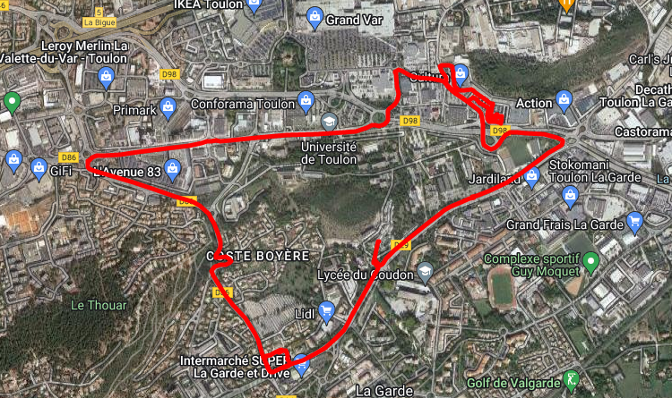
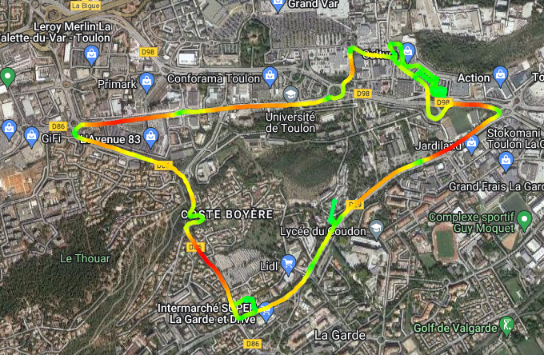
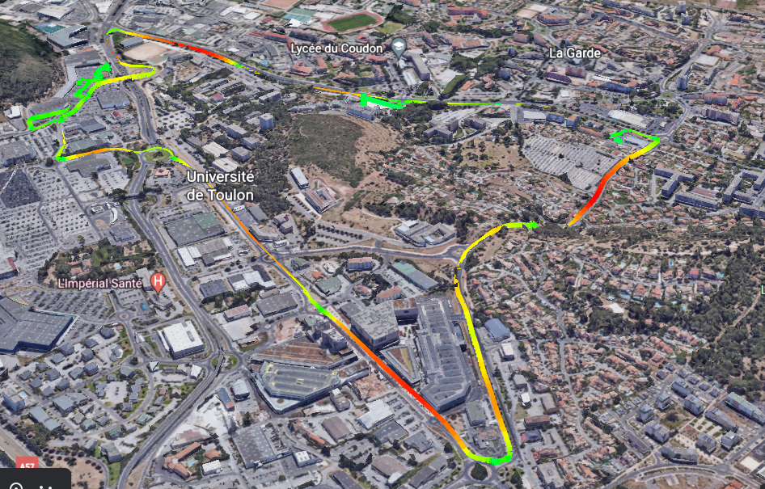
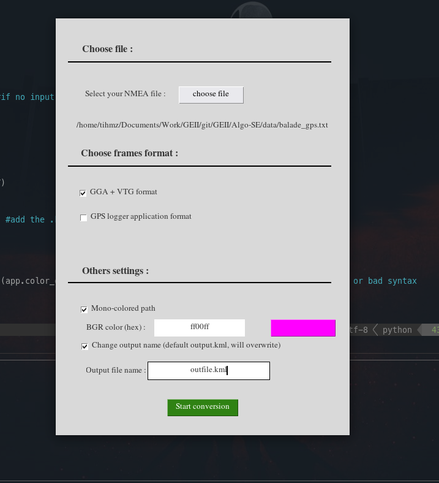

# NMEA to KML python converter

#### (by me)

### What does it do :

Take for input a file with NMEA frames (GGA for positions and VTG for speed)

It can also use the frames generated by the 'GPS logger' application on google play store

Generate a	.kml file, to display the route, with or without speed coloration on a kml viewer like https://ivanrublev.me/kml/

##### Without speed coloration:


##### With speed coloration:


Also have altitudes informations, so you can display it in google earth:

##### google earth 3D view:


I was bored so there is also a *beautiful* interface with tkinter to select your file and other options :



### How to use it :

simply launch the main script with `python3 src/nmea2kml.py`

You'll need the following pip packages to fully use it :
```
tkinter
os
sys
colorsys
numpy
re
```

You can manage each options with the globals variables in `src/nmea2kml.py`:
```py
USE_GUI = True
DEBUG_MESSAGE = True
OVERWRITE = True
                              _
INPUT_FILE="/tmp/data.txt"     |    
OUTPUT="output.kml"            |
MODE="colored"                 | - not necessary if using the GUI
COLOR="ff0000ff"               |
FORMAT = "GGA"                _|
NAME="My path"
```

